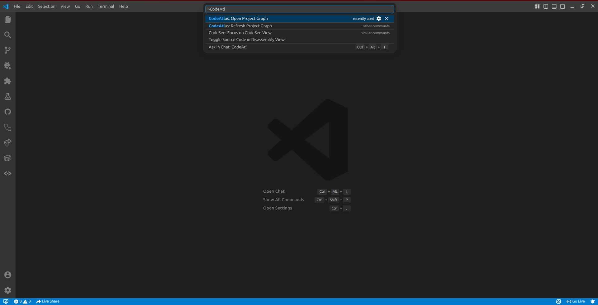
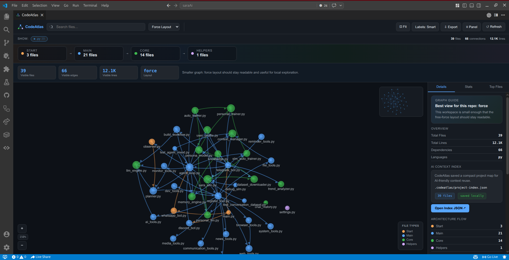
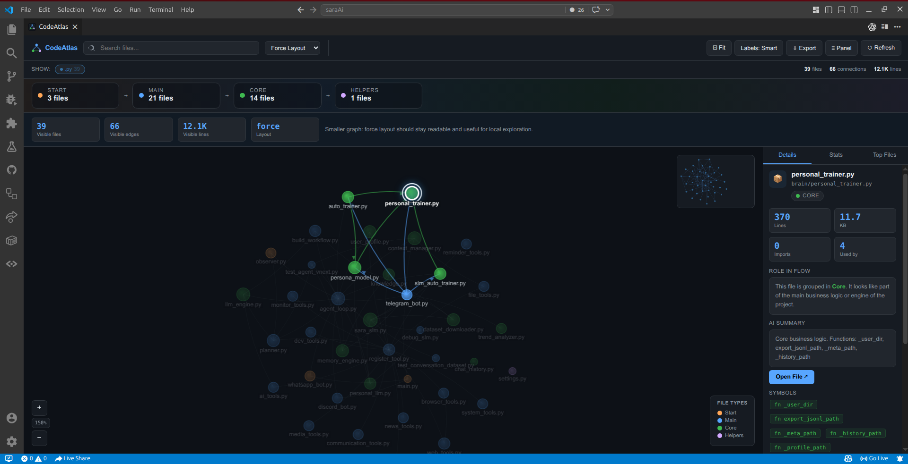
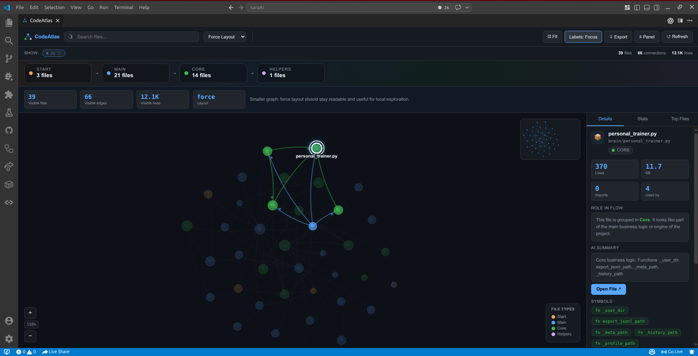
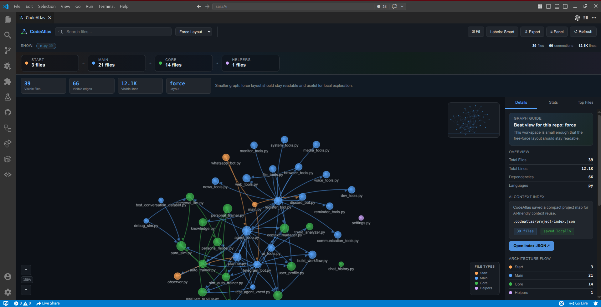
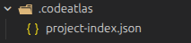

# CodeAtlas

CodeAtlas is a VS Code extension for visualizing your codebase as an interactive dependency graph inside VS Code.

Use it to understand file relationships, trace imports, explore module connections, and inspect project structure without leaving your editor.

It helps you explore:

- File dependencies across the project
- Module connections and import relationships
- Structural hotspots such as heavily imported files
- Folder-level distribution and codebase stats

## Why Use CodeAtlas

- Understand large codebases faster
- See which files are tightly coupled
- Find core modules and architecture hotspots
- Explore project structure visually instead of reading folders one by one
- Navigate from graph nodes directly to source files

## Screenshots

### 1. Open CodeAtlas From The Command Palette

Use `Ctrl+Shift+P` or `Cmd+Shift+P`, then run `CodeAtlas: Open Project Graph`.

### 2. See The Full Graph Overview

The main view shows file relationships, architecture flow, layout controls, filters, and quick workspace stats.

### 3. Inspect A File In Detail

Click any node to open the side panel with file stats, role in flow, AI summary, and extracted symbols.

### 4. Reduce Noise With Focused Labels

Use the label mode control to simplify dense graphs and keep attention on the selected area.

### 5. Reuse The AI Context Index

The stats panel highlights the saved `.codeatlas/project-index.json` file so AI tools can reuse compact project context.

### 6. Inspect The Saved Index File

You can open the generated project index directly and inspect the saved metadata on disk.

## Features

- Interactive graph view inside a VS Code webview
- Force, flow, radial, and folder-grouped layouts
- Click-to-focus node exploration
- Search for files by name or path
- Side panel with file details, imports, and reverse dependencies
- Architecture flow summary from Start to Main to Core to Helpers
- Workspace stats for files, edges, lines, folders, and external packages
- Local AI context index with per-file summaries, symbols, and dependency links
- Export graph data as JSON
- Refresh command for re-running analysis after code changes

## Commands

- `CodeAtlas: Open Project Graph`
- `CodeAtlas: Refresh Project Graph`

## How To Use

1. Open any project folder in VS Code.
2. Open the Command Palette with `Ctrl+Shift+P` or `Cmd+Shift+P`.
3. Run `CodeAtlas: Open Project Graph`.
4. Wait for the workspace scan to finish and the graph view to appear.

Inside the graph view:

- Click a node to inspect file details
- Double-click a node to open that file in the editor
- Use the search box to find files quickly
- Switch between `Force Layout`, `Flow Layout`, `Radial Layout`, and `Folder Groups`
- Change `Labels` mode to `Smart`, `Focus`, or `All` depending on graph density
- Use the filter chips to show only selected file types
- Use `Export` to save the analyzed graph as JSON
- Use `Refresh` after code changes to rebuild the graph

If your project is large, increase `codebaseVisualizer.maxFiles` in VS Code settings.

## Settings

The extension contributes these settings:

- `codebaseVisualizer.excludePatterns`
- `codebaseVisualizer.maxFiles`
- `codebaseVisualizer.includeExtensions`

## How It Works

The analyzer walks the current workspace, filters files by extension, extracts imports for supported languages, resolves local module references, and sends the resulting graph data into the visual explorer panel.

It also builds a local project index at `.codeatlas/project-index.json` with compact per-file metadata such as:

- file path
- short AI-friendly summary
- functions and classes
- exports
- local dependencies
- reverse dependencies

This index is designed to help AI tools reuse a compact code map instead of reading every source file in full for every task.

This makes CodeAtlas useful for:

- Dependency analysis
- Architecture review
- Refactoring preparation
- Onboarding into unfamiliar repositories
- Finding high-impact files quickly

## Supported File Types

Default analysis includes:

- JavaScript: `.js`, `.jsx`, `.mjs`, `.cjs`
- TypeScript: `.ts`, `.tsx`
- Python: `.py`
- Frontend modules: `.vue`, `.svelte`

The analyzer also contains parsing patterns for additional languages such as Go, Rust, Java, C#, Ruby, and PHP, which can be enabled by including those extensions in settings.

## Development

1. Open this folder in VS Code.
2. Press `F5` to launch an Extension Development Host.
3. In the new window, run `CodeAtlas: Open Project Graph`.

## Notes

- The current manifest is marked as `preview` until you finish testing in a real Extension Development Host.
- Very large repos may need a higher `codebaseVisualizer.maxFiles` value.
- Marketplace ranking also improves over time with installs, ratings, reviews, and good release notes.
